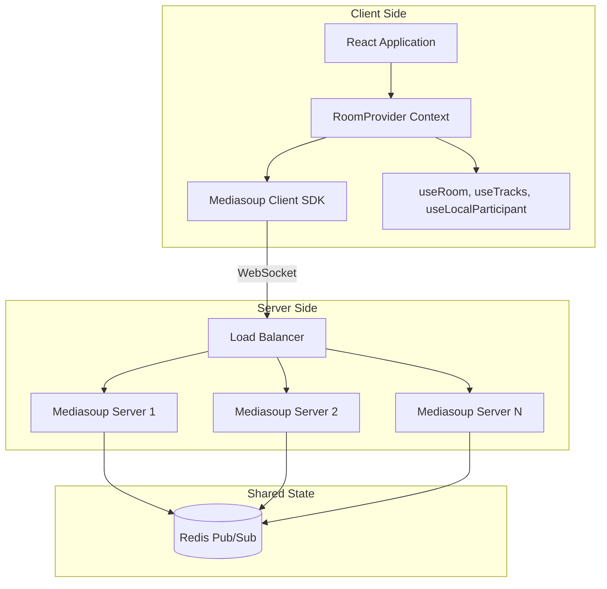
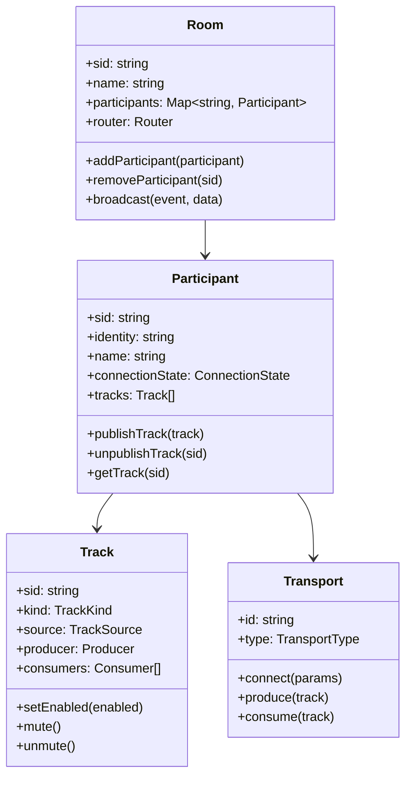
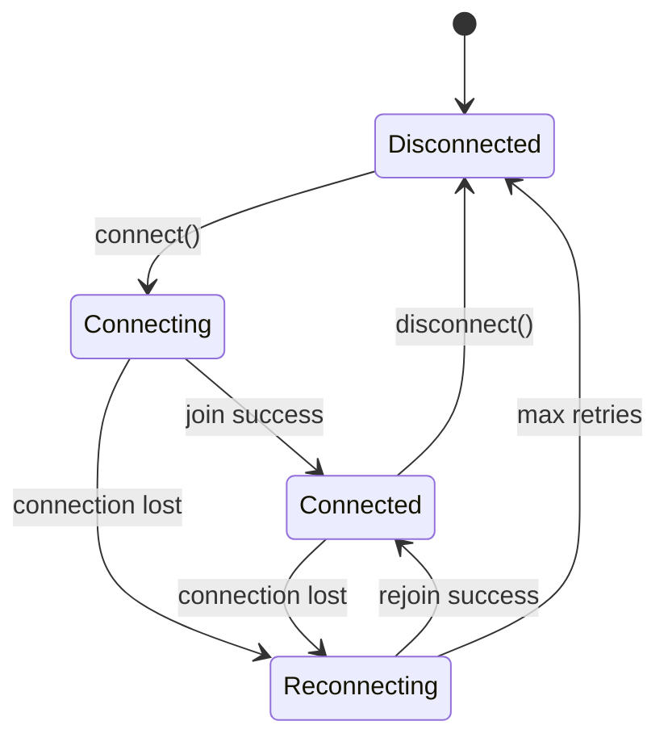
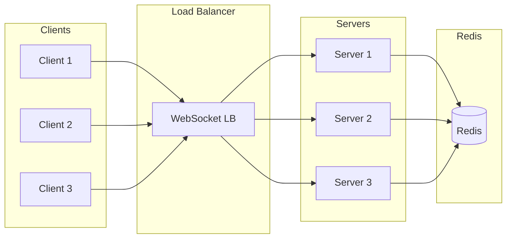

# Mediasoup Wrapper - Scalable Architecture (LiveKit-style)

## Overview

This project provides a complete WebRTC solution built on top of mediasoup, following a LiveKit-style architecture:

- **Server**: Self-hosted or Docker-deployable mediasoup SFU server
- **Client SDK**: React library with Provider pattern and simple hooks like `useRoom`, `useTracks`, `useLocalParticipant`

## System Architecture



## Monorepo Structure

```
mediasoup-lib/
├── packages/
│   ├── server/                    # Server (deployed via Docker or self-hosted)
│   │   ├── src/
│   │   │   ├── sfu/               # Mediasoup SFU logic
│   │   │   │   ├── Room.ts
│   │   │   │   ├── Participant.ts
│   │   │   │   ├── Transport.ts
│   │   │   │   └── Producer.ts
│   │   │   ├── auth/              # JWT token generation/validation
│   │   │   │   ├── TokenService.ts
│   │   │   │   └── AccessToken.ts
│   │   │   ├── websocket/         # WebSocket server
│   │   │   │   ├── WebSocketServer.ts
│   │   │   │   └── handlers.ts
│   │   │   ├── api/               # REST API for token generation
│   │   │   │   ├── routes.ts
│   │   │   │   └── controllers.ts
│   │   │   ├── redis/             # Redis integration
│   │   │   │   ├── RedisManager.ts
│   │   │   │   └── PubSub.ts
│   │   │   ├── config/            # Configuration
│   │   │   │   └── index.ts
│   │   │   └── index.ts
│   │   ├── Dockerfile
│   │   ├── docker-compose.yml
│   │   ├── package.json
│   │   └── tsconfig.json
│   │
│   ├── client/                    # Client SDK (npm package)
│   │   ├── src/
│   │   │   ├── components/        # React Provider and components
│   │   │   │   ├── RoomProvider.tsx
│   │   │   │   ├── RoomContext.tsx
│   │   │   │   ├── ParticipantView.tsx
│   │   │   │   └── TrackView.tsx
│   │   │   ├── hooks/             # React hooks (main API)
│   │   │   │   ├── useRoom.ts
│   │   │   │   ├── useTracks.ts
│   │   │   │   ├── useLocalParticipant.ts
│   │   │   │   ├── useParticipants.ts
│   │   │   │   ├── useDataChannel.ts
│   │   │   │   └── useConnectionState.ts
│   │   │   ├── client/            # Core client logic
│   │   │   │   ├── RoomClient.ts
│   │   │   │   ├── Participant.ts
│   │   │   │   ├── Track.ts
│   │   │   │   └── LocalParticipant.ts
│   │   │   ├── transports/        # Transport layer
│   │   │   │   ├── WebSocketTransport.ts
│   │   │   │   └── SignalingClient.ts
│   │   │   ├── media/             # Media handling
│   │   │   │   ├── MediaTrack.ts
│   │   │   │   ├── TrackPublication.ts
│   │   │   │   └── TrackSettings.ts
│   │   │   ├── data/              # Data channels
│   │   │   │   ├── DataChannel.ts
│   │   │   │   └── DataPacket.ts
│   │   │   ├── types/             # TypeScript types
│   │   │   │   ├── index.ts
│   │   │   │   ├── room.types.ts
│   │   │   │   ├── track.types.ts
│   │   │   │   └── participant.types.ts
│   │   │   ├── utils/             # Utilities
│   │   │   │   ├── logger.ts
│   │   │   │   └── helpers.ts
│   │   │   └── index.ts           # Main entry point
│   │   ├── package.json
│   │   └── tsconfig.json
│   │
│   └── shared/                    # Shared types
│       ├── src/
│       │   ├── types/
│       │   │   ├── room.types.ts
│       │   │   ├── track.types.ts
│       │   │   ├── participant.types.ts
│       │   │   ├── signal.types.ts
│       │   │   └── token.types.ts
│       │   ├── constants/
│       │   │   ├── events.ts
│       │   │   └── errors.ts
│       │   └── index.ts
│       ├── package.json
│       └── tsconfig.json
│
├── plans/                         # Architecture and planning docs
│   ├── architecture.md
│   └── roadmap.md
├── .gitignore
├── package.json
├── pnpm-workspace.yaml
├── turbo.json
└── tsconfig.base.json
```

## Client SDK API (LiveKit-style)

### RoomProvider - Main Entry Point

```typescript
import { RoomProvider } from "@mediasoup-lib/client";

function App() {
  return (
    <RoomProvider
      token={accessToken}
      serverUrl="wss://your-mediasoup-server.com"
      options={{
        autoConnect: true,
        adaptiveStream: true,
        dynacast: true,
      }}
    >
      <YourRoomComponent />
    </RoomProvider>
  );
}
```

### React Hooks

```typescript
// useRoom - Main room management
const room = useRoom();

room.connect();
room.disconnect();
room.name;
room.participants;
room.localParticipant;

// useTracks - Get all tracks (local and remote)
const tracks = useTracks();

tracks.map((track) => <TrackView key={track.sid} track={track} />);

// useLocalParticipant - Access local participant
const localParticipant = useLocalParticipant();

localParticipant.setCameraEnabled(true);
localParticipant.setMicrophoneEnabled(false);
localParticipant.publishTrack(track);
localParticipant.unpublishTrack(trackSid);

// useParticipants - Get all participants
const participants = useParticipants();

participants.map((p) => <ParticipantView key={p.sid} participant={p} />);

// useDataChannel - Send/receive data
const { sendData, onData } = useDataChannel();

sendData({ type: "chat", message: "Hello" });
onData((data) => console.log("Received:", data));

// useConnectionState - Monitor connection
const state = useConnectionState();
// 'connected' | 'disconnected' | 'reconnecting'
```

### Components

```typescript
// ParticipantView - Display a participant
<ParticipantView participant={participant} />

// TrackView - Display a track (video/audio)
<TrackView track={track} />

// VideoConference - All-in-one component
<VideoConference />
```

## Server Architecture

### Core Components



### WebSocket Protocol

#### Client → Server

```typescript
// Join room
{
  type: 'join',
  room: 'room-name',
  token: 'jwt-token'
}

// Publish track
{
  type: 'publish',
  kind: 'audio' | 'video',
  rtpParameters: {...},
  appData: {...}
}

// Subscribe to track
{
  type: 'subscribe',
  trackSid: 'track-sid',
  rtpCapabilities: {...}
}

// Mute/unmute track
{
  type: 'mute',
  trackSid: 'track-sid',
  muted: true
}

// Send data
{
  type: 'data',
  payload: {...},
  kind: 'reliable' | 'lossy'
}

// Leave room
{
  type: 'leave'
}
```

#### Server → Client

```typescript
// Room joined
{
  type: 'joined',
  room: {...},
  participant: {...},
  otherParticipants: [...]
}

// Participant joined
{
  type: 'participant_joined',
  participant: {...}
}

// Participant left
{
  type: 'participant_left',
  participantSid: '...'
}

// Track published
{
  type: 'track_published',
  participantSid: '...',
  track: {...}
}

// Track subscribed
{
  type: 'track_subscribed',
  track: {...},
  rtpParameters: {...}
}

// Track muted
{
  type: 'track_muted',
  trackSid: '...',
  muted: true
}

// Data received
{
  type: 'data',
  participantSid: '...',
  payload: {...}
}

// Error
{
  type: 'error',
  message: '...',
  code: 123
}
```

## Token Service (JWT)

### Server-side Token Generation

```typescript
import { AccessToken } from "@mediasoup-lib/server";

const token = new AccessToken(API_KEY, API_SECRET, {
  identity: "user-123",
  name: "John Doe",
  metadata: { role: "host" },
});

token.addGrant({
  room: "room-name",
  roomJoin: true,
  canPublish: true,
  canSubscribe: true,
  canPublishData: true,
});

const jwt = token.toJwt();
```

### Token Structure

```typescript
interface AccessTokenClaims {
  // Identity
  identity: string;
  name?: string;
  metadata?: Record<string, any>;

  // Grants
  room: string;
  roomJoin?: boolean;
  canPublish?: boolean;
  canSubscribe?: boolean;
  canPublishData?: boolean;

  // Metadata
  nbf?: number; // Not before
  exp?: number; // Expiration
}
```

## Room Lifecycle



## Track Types

```typescript
enum TrackKind {
  Audio = "audio",
  Video = "video",
}

enum TrackSource {
  Camera = "camera",
  Microphone = "microphone",
  ScreenShare = "screen_share",
  ScreenShareAudio = "screen_share_audio",
  Unknown = "unknown",
}

interface Track {
  sid: string;
  kind: TrackKind;
  source: TrackSource;
  participant: Participant;
  isMuted: boolean;
  isEnabled: boolean;
}
```

## Scalability

### Horizontal Scaling



### Redis Usage

- **Room State**: Store room metadata and participant lists
- **Pub/Sub**: Cross-server event broadcasting
- **Session Affinity**: Track which server hosts each room

## Docker Deployment

### docker-compose.yml

```yaml
version: "3.8"

services:
  mediasoup:
    image: mediasoup-lib/server:latest
    ports:
      - "3000:3000" # HTTP API
      - "40000:40000/udp" # Media ports
      - "40001:40001/udp"
      - "40002:40002/udp"
    environment:
      - MEDIASOUP_MIN_PORT=40000
      - MEDIASOUP_MAX_PORT=50000
      - REDIS_HOST=redis
      - REDIS_PORT=6379
      - JWT_SECRET=your-secret
      - API_KEY=your-api-key
      - API_SECRET=your-api-secret
    depends_on:
      - redis
    restart: unless-stopped

  redis:
    image: redis:7-alpine
    ports:
      - "6379:6379"
    volumes:
      - redis-data:/data
    restart: unless-stopped

volumes:
  redis-data:
```

## Configuration

### Server Configuration

```typescript
interface ServerConfig {
  // Server
  port: number;
  host: string;

  // Mediasoup
  mediasoup: {
    numWorkers: number;
    rtcMinPort: number;
    rtcMaxPort: number;
    logLevel: "debug" | "warn" | "error";
  };

  // Redis
  redis: {
    host: string;
    port: number;
  };

  // API Keys
  apiKey: string;
  apiSecret: string;

  // JWT
  jwt: {
    expiresIn: string;
  };

  // ICE Servers
  iceServers: {
    urls: string[];
    username?: string;
    credential?: string;
  }[];
}
```

### Client Configuration

```typescript
interface RoomConnectOptions {
  // Connection
  autoConnect?: boolean;
  autoSubscribe?: boolean;

  // Media
  adaptiveStream?: boolean;
  dynacast?: boolean;

  // Defaults
  publishDefaults?: {
    audio?: boolean;
    video?: boolean;
    screenShare?: boolean;
  };

  // Reconnection
  reconnectAttempts?: number;
  reconnectDelay?: number;

  // ICE
  iceServers?: RTCIceServer[];
}
```

## Package Publishing

### Client Package

- **Name**: `@mediasoup-lib/client`
- **Install**: `npm install @mediasoup-lib/client`
- **Usage**: Import RoomProvider and hooks

### Server Docker Image

- **Name**: `mediasoup-lib/server`
- **Pull**: `docker pull mediasoup-lib/server:latest`
- **Usage**: Run with docker-compose or kubernetes

## Usage Examples

### Basic Video Call

```typescript
import {
  RoomProvider,
  useRoom,
  useLocalParticipant,
  useTracks,
  TrackView,
} from "@mediasoup-lib/client";

function VideoRoom() {
  const room = useRoom();
  const localParticipant = useLocalParticipant();
  const tracks = useTracks();

  return (
    <div>
      <button onClick={() => localParticipant.setCameraEnabled(true)}>
        Enable Camera
      </button>
      <button onClick={() => localParticipant.setMicrophoneEnabled(true)}>
        Enable Mic
      </button>

      {tracks.map((track) => (
        <TrackView key={track.sid} track={track} />
      ))}
    </div>
  );
}

function App() {
  return (
    <RoomProvider token={token} serverUrl="wss://mediasoup.example.com">
      <VideoRoom />
    </RoomProvider>
  );
}
```

### Screen Sharing

```typescript
function ScreenShare() {
  const localParticipant = useLocalParticipant();

  const startScreenShare = async () => {
    const stream = await navigator.mediaDevices.getDisplayMedia({
      video: true,
      audio: true,
    });
    await localParticipant.publishTrack(stream.getVideoTracks()[0]);
  };

  return <button onClick={startScreenShare}>Share Screen</button>;
}
```

### Data Channel

```typescript
function Chat() {
  const { sendData, onData } = useDataChannel();
  const [messages, setMessages] = useState([]);

  useEffect(() => {
    onData((data) => {
      if (data.type === "chat") {
        setMessages((prev) => [...prev, data]);
      }
    });
  }, [onData]);

  const sendMessage = (text) => {
    sendData({ type: "chat", message: text });
  };

  return (
    <div>
      {messages.map((m) => (
        <div>{m.message}</div>
      ))}
      <input
        onKeyPress={(e) => {
          if (e.key === "Enter") sendMessage(e.target.value);
        }}
      />
    </div>
  );
}
```

## Security

1. **JWT Tokens**: All room access requires valid JWT
2. **API Keys**: Server uses API key/secret pair for token generation
3. **CORS**: Configurable CORS for WebSocket connections
4. **Rate Limiting**: Prevent abuse of API endpoints
5. **TURN Server**: Use TURN for NAT traversal
6. **Secure WebSocket**: WSS required in production
